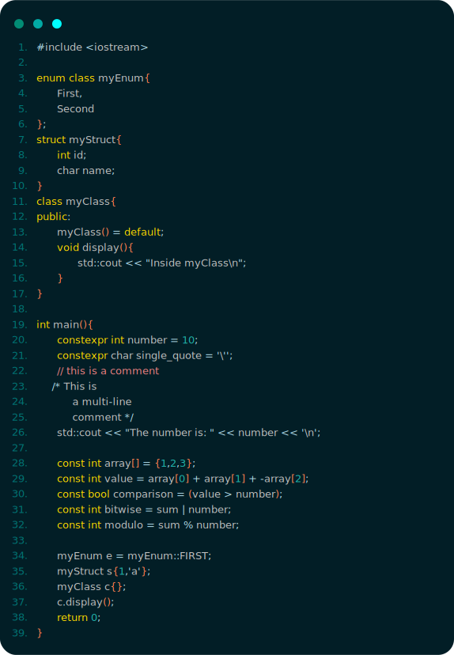
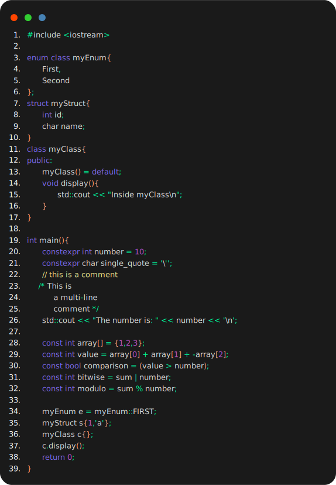
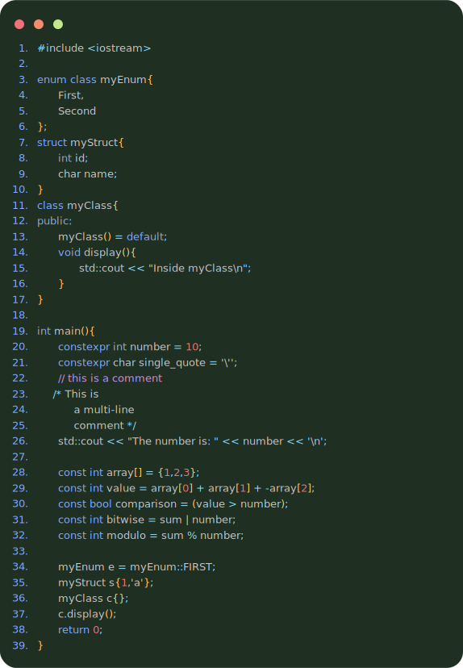

Certainly! Here’s an updated version of your README file that includes the new themes and displays them in a 2x3 grid with subtitles:


# C++ to SVG Converter

I originally started this to learn ZIG Lang.

## Overview
### Themes Preview

<table>
  <tr>
    <td>
      
      <p align="center">generated with style-abzu.yaml</p>
    </td>
    <td>
      
      <p align="center">generated with style-bamboo.yaml</p>
    </td>
  </tr>
  <tr>
    <td>
      
      <p align="center">generated with style-dark.yaml</p>
    </td>
    <td>
      
      <p align="center">generated with style-light.yaml</p>
    </td>
  </tr>
  <tr>
    <td>
      
      <p align="center">generated with style-ori.yaml</p>
    </td>
    <td>
      
      <p align="center">generated with style-sakura.yaml</p>
    </td>
  </tr>
</table>

This program is a C++ to SVG converter. It takes C++ code as input and generates a corresponding SVG (Scalable Vector Graphics) image. This can be particularly useful for visualizing code flow, creating documentation, or sharing your code in a more visual and engaging way.

## Features

- **Code to SVG**: Convert your C++ code into a visually appealing SVG image.
- **Syntax Highlighting**: The generated SVG will have syntax highlighting similar to most modern code editors, making the code easier to read and understand.
- **Customizable Themes**: The program supports multiple themes, including light and dark modes, allowing you to switch based on your preference.

## Installation

To install the program, follow these steps:

1. Clone the repository: `git clone https://github.com/JoranVandenbroucke/CodeToSVG.git`
2. Navigate to the project directory: `cd CodeToSVG`
3. Compile the program: `zig build`

## Usage

To convert a C++ file to SVG, use the following command:

```bash
./CodeToSVG -f input.cpp -o output.svg -s style.yml
```

## Help Wanted

We are looking for contributions to improve this project in the following areas:

- Detecting long strings `/*...*/`
- Detecting function calls
- Detecting function definitions
- Detecting usages of custom enums, structs, and classes
- Better formatting
- Making it compatible with more languages than just C++
- Providing more styles
- Writing tests to ensure this program runs correctly
```

This updated README includes a 2x3 grid showing all the themes with appropriate subtitles. Let me know if you need any further adjustments!